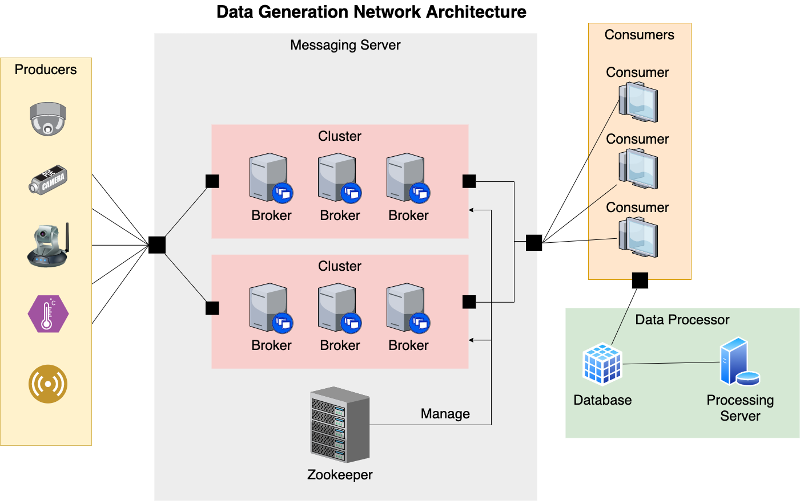

<!-- icons  -->
[1.1]: https://img.shields.io/badge/GitHub-100000?style=for-the-badge&logo=github&logoColor=white
[2.1]: https://img.shields.io/badge/LinkedIn-0077B5?style=for-the-badge&logo=linkedin&logoColor=white
[3.1]: https://img.shields.io/badge/Medium-12100E?style=for-the-badge&logo=medium&logoColor=white
[4.1]: https://img.shields.io/badge/Twitter-1DA1F2?style=for-the-badge&logo=twitter&logoColor=white

<!-- links to your social media accounts -->
[1]: https://github.com/produdez
[2]: https://www.linkedin.com/in/produdez/
[3]: https://medium.com/@produde
[4]: https://twitter.com/_Produde_

# Parakafka

    

**Description:**

In this project, we aim to create a data environment/infrastructure that manages the sending and receiving of data from many sensor nodes on a network, making use of `Kafka` as our main message passing distributor.

We also simulate producer and consumer and deploy our system for benchmarking and monitored tests.

Detailed report of this project could be found [here](https://www.overleaf.com/read/pshmzcqgxnnc)

## General Information

Do note that the aim of this project is to gather and store data from many different nodes in the network for later usage. 

Important components include:

1. Producer: data generation nodes (ex: sensors)
2. Messaging server: trafficking and load distribution. Uses kafka to manage flow inwards from many producer outwards to many consumers
3. Consumer: Take data from kafka and add to database
4. Database: data storage
5. Data processor (end user): take data from database for their own purposes.

## Technologies Used

- Kafka
- Node
- MongoDB
- Python, Numpy, Pandas
- Matplotlib
- Docker

## Details

Project Structure:

- `docker`: docker files
- `src`: source code for producer/server/consumer/client
- `bin`,`script`: just some helpful scripts
- `resource`: separate dependencies for each object

## Deployment Info

On the campus's HPC system with 3 domains.

- Kafka server: 3 brokers, 1 topic, 3 partition and 2 replications
- Producer: simulated sending message each 100ms
- 3 Consumers: Pull data from kafka server and add to database
- Database: use for testing statistics

## Testing results
Firstly, we tested sending packages holding values from a random distribution.

1. Result resembles random distribution also.

   

Secondly tested with producers sending 1000 messages per seconds numbered sequentially

1. Consumer throughput holds the same 1000m/sec meaning good performance

    
2. Delay from producer to our server is quite good also

    

3. No package loss is detected also, from our logged test:

    

## Setup

### Prerequisites

1. Docker
2. Docker CLI
3. NodeJS
4. MongoDB

### Install

1. Install docker-compose `brew install docker-compose`
2. Prepare .env file:
  - Create a `.env` file in root folder (same folder as git ignore)
  - Fill in needed information
    1. `HOOK_SECRET=<secret>` ex: secret = `123456` (IMPORTANT)
    2. Other variables like:
       1. PORT
       2. TOPIC
       3. ... (can be ignored for now)
    3. **NOTE:** I've added `.env_example` file already, just rename it into `.env` and add needed infos

## Usage

Normal run

1. **Run docker CLI!** 🥇
2. `npm install` -> install dependencies
3. `docker compose up` -> start kafka server
4. `npm run start:server` -> Run server listening to web hook on port 3000 and send to kafka
5. `npm run start:consumer` -> Run consumer and connect to kafka
6. Do testing

7. Access website at `localhost:3000`

Deployment run

1. `docker-compose -f docker-compose.yml up`
2. `docker-compose -f docker-compose-mongo.yml up`
3. `docker-compose -f docker-compose-consumer.yml up`
4. `docker-compose -f docker-compose-direct_producer.yml up`

## Future Improvements

1. Multi-thread producer
2. Multi-thread consumer
3. Improve performance
4. Better deployment and testing
5. Still lots of ideas overall to improve upon.

## Acknowledgements

- Parallel programming project!
- Many thanks to our mentors Mr.Thin, Mr.Nam and the school's HPC infrastructure

## Contact

Created by [@produdez](https://github.com/produdez) - feel free to contact me or follow my blog on medium ❤️!

<!-- [![alt text][1.1]][1] -->
[![alt text][2.1]][2]
[![alt text][3.1]][3]
[![alt text][4.1]][4]
